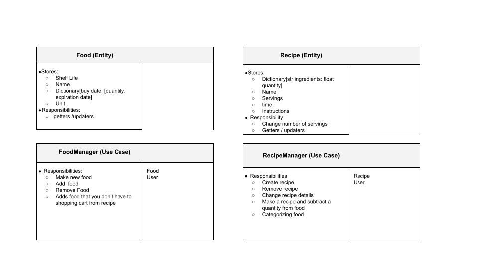
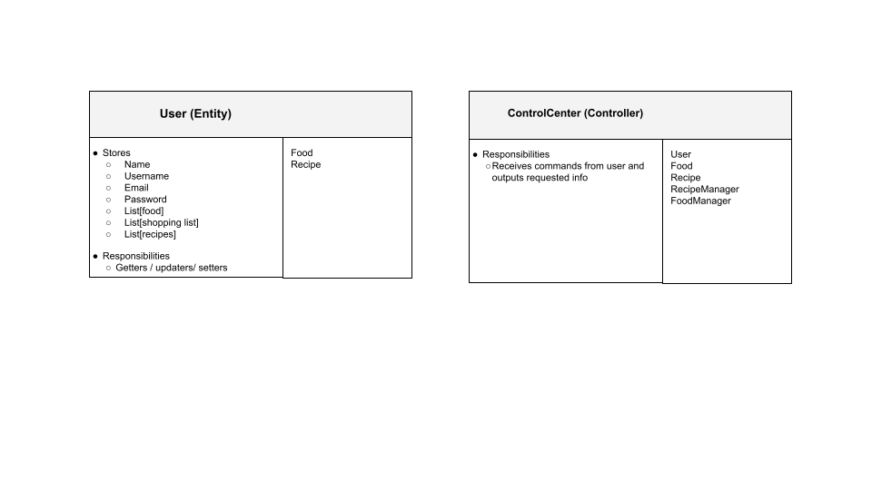

### **CRC Model**

### **Command Line**
Display recipes (no parameters) (kitchen)
- Gives a list of all recipes in the kitchen

Show recipe (no parameters) (recipe)
- List of ingredients, instructions, servings

Display recipes with (Food food_name) (kitchen)
- Displays the recipes with the given food first
- If there are many foods it will display the recipes with the most number of ingredients that correspond

- Display food (kitchen)
- Shows all the food you have with the quantity

Show food by expiration (kitchen manager)

Show shopping list (kitchen)
- Shows what you need to buy

Add ingredients to shopping list
- Manually: input what foods you want to buy
- Automatically: puts all ingredients needed for recipe you don’t already have into shopping cart

Make recipe (int servings, str recipe)
- Subtracts the food quantity from food, assumes that you use the oldest food to newest 
